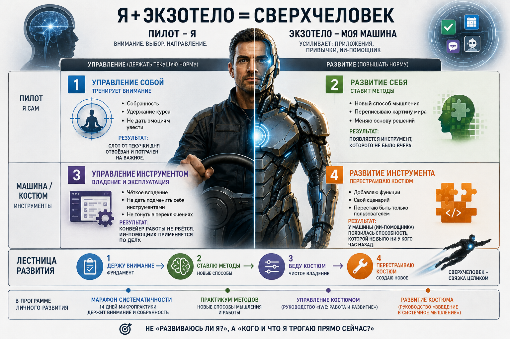

# Установочная S1 — план встречи

> Открытая встреча, не только для записавшихся. Задача - не рассказ про обновления, а сразу полезный кусок новой механики: как выбрать проект, найти следующий шаг, увидеть, как одна рабочая сессия даёт сразу три результата. Слово «установочная»/«ознакомительная» вслух не произносим. Структура и тайминг - см. `01-presentation-structure.md` рядом.

---

## Слайд 1 — Обложка

**Добро пожаловать!**

Сегодня не рассказ про обновления - сразу разбираем на деле, как теперь устроена работа в программе «Личное развитие» и в практикуме S1 «Собранность».

*Ведущий: Церен Церенов, автор программы «Личное развитие» и разработчик IWE*

---

## Слайд 2 — Сегодня

*Текст причёсан (12.09, седьмой проход) - убраны глаголы-обещания «покажем/расскажем/разберём», формулировки выровнены до параллельных именных фраз.*

За ~95 минут:
- Что изменилось в устройстве программы «Личное развитие»
- Практикум S1 «Собранность»
- Как выбрать свой проект
- Разбор ваших кейсов

---

## Слайд 3 — Свой проект вместо общего маршрута

*Картинка `bylo-stalo-project.svg` справа, укрупнена до 70% ширины слайда (12.09, седьмой проход - при 58% всё ещё было плохо видно). Текст слева уменьшен до 18px через `<style scoped>` в начале слайда - обычный `
` здесь не сработал (шрифт визуально не менялся, часть текста «убегала» за нижний край слайда), `<style scoped>` внутри слайда - единственный надёжный способ переопределить типографику в этом рендере marp-cli.*

**«Свой проект вместо общего учебного маршрута. Нужные методы и знания подключаются тогда, когда они требуются именно вашему следующему шагу.»**

Сначала ставим способ работы на своём проекте подходящего масштаба - дальше переносите его на более сложные проекты.

**Руководство** - полка метода. Читаете не по порядку, когда нужно именно это знание.

**Практикум** - отрезок пути с наставником, который переводит вас на следующую ступень.

Раньше это было перепутано в одном названии. Теперь разведено: руководство остаётся полкой, практикум становится путём.

---

## Слайд 4 — (картинка без заголовка)

*Переставлен сюда с прежней позиции 12 (12.09, восьмой проход, решение пилота) - усиливает мысль «свой проект вместо общего маршрута» сразу, а не в середине встречи. Готовая инфографика из личных Загрузок (21:39). Заголовок встроен в картинку.*

Показывает пару «Раньше / Сейчас»: раньше - обязательный жёсткий план, чек-лист домашних заданий по руководству (изучить раздел, выполнить ДЗ на моделирование, написать заготовку); сейчас - фокус смещается на реализацию своего проекта через IWE, а изучение руководства и выполнение ДЗ подписано прямо на картинке «уже по возможности, если будет время и возможность углубиться в детали».

*Забегает вперёд перед словом «по возможности» на диаграмме каскада (слайд 14) - но это нормально, ведущий может просто указать на неё коротко здесь и вернуться к слову подробнее там.*

---

## Слайд 5 — Одна сессия - три результата

*Готовая инфографика из личных Загрузок (06.09, 09:02) заменяет прежнюю картинку. Заголовок встроен в картинку - отдельного markdown-заголовка на слайде нет.*

Показывает: слева - вход (вопросы, проблемы, проекты, данные, материалы, идеи и другое), в центре - «Сессия: работы · саморазвития · жизни» + «Человек + IWE. Действуем. Думаем. Создаём. Сохраняем», справа - три результата (продвинулся проект / вырос сам человек / обновилась среда). Внизу - «каждая сессия делает вас сильнее и в текущем, и в будущем».

Это стержень сегодняшней встречи - вернёмся к нему в блоке 22, на вашем собственном примере.

*13.09, Алёна: поднят с позиции 15 сразу после слайда 4 - ценность приходила слишком поздно, до неё шла лекция об устройстве программы. Порядок теперь: что изменилось → зачем мне это → три результата одной работы → и только потом устройство программы.*

---

## Слайд 6 — Живое упражнение: работа в чате (10 минут)

*(Пауза для работы участников. Ведущий читает чат по ходу, отмечает 2-3 рабочих продукта для разбора на следующем слайде.)*

---

## Слайд 7 — Руководства и практикумы: разные имена, разные цели

*Готовая инфографика из личных Загрузок (12.09, 19:52) заменяет прежнюю таблицу. Заголовок уже встроен в картинку - отдельного markdown-заголовка на слайде нет.*

Показывает: четыре руководства программы «Личное развитие» слева, воронка «под ваши проекты» посередине, практикумы S0-S3 с наставником справа (S1 «Собранность» выделен - «вы здесь»). Внизу - формула: практикум = нужные знания + ваши проекты + наставник = результаты в проекте (13.09, Алёна: было «реальные результаты» - «слишком нейроночно», заменено прямо на картинке).

Устно проговорить то же, что раньше было текстом: мы не переименовываем и не отменяем руководства - практикум берёт нужные куски из нескольких руководств под вашу задачу.

---

## Слайд 8 — Ступени ученика: от интереса к результатам

*Готовая инфографика из личных Загрузок (12.09, 20:09). Заголовок встроен в картинку.*

Показывает: пять ступеней ученика (Случайный → Практикующий → Систематический → Дисциплинированный → Проактивный) как горку восходящих ступеней, с наложенными практикумами S0-S3 (какой практикум ведёт с какой ступени на какую). Внизу - трек «от интереса к действию → от действий к привычкам → от привычек к большим результатам».

Это общий обзор перед детальным разбором лестницы на следующем слайде.

---

## Слайд 9 — Вся программа теперь стоит на ИИ-среде

*Готовая инфографика из личных Загрузок (12.09, 21:11, шестой проход) заменяет прежний текстовый слайд. Заголовок встроен в картинку.*

Показывает три панели: «Раньше» - наставник вручную определяет, что нужно дальше по методам программы; в центре - ИИ-среда как технологическая основа, куда стекаются методы/знания/практикумы/руководства; «Теперь» - наставник и ИИ-среда вместе подбирают нужный практический метод под ступень и проект. Внизу - цитата: раньше вся работа строилась на культуре использования компьютера, сейчас так же важна ИИ-среда, IWE - наша реализация.

*(Вывод из переписки с Алёной Чайковской вечером 12.09 - только этот смысл, без сопутствующего обсуждения продажи наставничества и вебинара по самозапуску.)*

---

## Слайд 10 — Основной показатель — систематичность

*Подписи «≈X ч/нед» под каждой ступенью и текст в подписи под графиком укрупнены (12.09, пятый проход) - должны читаться с задних рядов/на маленьком экране трансляции.*

Случайный → Практикующий → Систематический → Дисциплинированный → Проактивный. Ступень - не оценка навсегда: пересчитывается по вашей практике за 4-8 недель, подтверждается диагностикой не реже раза в полгода.

Подробные критерии - не сейчас, это тема занятия 1. Сегодня достаточно понимать саму лестницу.

---

## Слайд 11 — Другие отслеживаемые показатели по ступеням Ученика

*Готовая инфографика из личных Загрузок (12.09, 21:01, шестой проход) заменяет прежний текстовый слайд.*

Показывает: слева - «Собранность» включает Систематичность (выделена), Ритмичность, Внимательность и другие характеристики; справа - ещё четыре отдельных показателя: Агентность, Мировоззренческая зрелость, Системность, Оснащённость. Внизу - «и другие показатели».

Снимает прежнее замечание про дублирование с таблицей «Новичок» (слайд 17) - набор и формулировки показателей здесь другие.

---

## Слайд 12 — Где на этой лестнице начинается S1

*Переставлен раньше «Основы созидателя» (12.09, шестой проход) - сначала спрашиваем участников про их ступень, потом показываем общую картину.*

Практикум «Собранность» закрепляет ритм ступеней 1-2 и ведёт к ступени 3 - систематическому ученику.

*В чат: какая ступень сейчас кажется вам ближайшей? Не нужен точный ответ - это не диагностика, просто ориентир для вас самих.*

---

## Слайд 13 — Основа созидателя: путь к вершине

*Готовая инфографика из личных Загрузок (12.09, 20:10). Заголовок встроен в картинку.*

Показывает: лестница ступеней ученика (внизу, «от Случайного до Проактивного») - это только основание более длинного пути. Дальше вверх - Интеллектуал → Профессионал → Исследователь → Просветитель, а на самой вершине - фигура человека, смотрящего на горы (образ усиленного человека).

*Говорит ведущий: то, что мы сегодня разбираем - это первые ступени под самим основанием. Дальше дорога идёт намного дальше, но начинается она отсюда.*

---

## Слайд 14 — Что растим на каждом практикуме

*Заголовок сменён с «...на каждом шаге» (12.09, восьмой проход) - точнее отражает, что каждая строка таблицы это практикум (S0-S3), а не абстрактный «шаг».*

*Строки подписаны кодами потоков (12.09, восьмой проход): S0 Марафон, S1 Собранность, S2 Агентность, S3 Системность - привязывает диаграмму к названиям практикумов из слайда 6. Текст в цветных ячейках («растит», «крепче», «первый заход») укрупнён и выделен жирным (12.09, пятый проход). Слои ячеек:*

- ***«По возможности»*** *(пунктирные ячейки янтарного цвета) - необязательный заход при наличии ресурса: Марафон×Мировоззрение, Собранность×Мастерство, Собранность×Системы, Агентность×Системы. Четвёртая ячейка (Собранность×Системы) добавлена восьмым проходом - раньше была пустой.*
- ***«Продолжение»*** *(подписаны прежде пустые светло-голубые ячейки) - несём дальше без отдельного фокуса, не выключаем: Агентность×Внимание, Системность×Внимание, Системность×Мировоззрение.*
- *Внизу диаграммы - расширенная легенда, объясняющая все четыре цвета/стиля ячеек.*

Марафон растит Внимание. Собранность растит Внимание сильнее и уже приоткрывает Мировоззрение. Агентность растит Мировоззрение сильнее и делает заход на Мастерство. Системность растит Мастерство сильнее и делает заход на Системное мышление. Ничего не выключается по пути - ступень подтверждается по совокупности всех измерений, а не по одному практикуму.

*Что показывать устно, если кто-то спросит про пунктирные и светло-голубые ячейки: пунктир - было бы хорошо, но не обязательно в это окно (конкретный пример уже показали на слайде 4); светло-голубое без подписи и «продолжение» - уже наросло раньше и никуда не делось, просто сейчас фокус в другом месте.*

---

## Слайд 15 — Развитие Мастерства

*Заголовок укорочен с «Вторая линия роста: мастерство работы с IWE» (12.09, шестой проход). Картинка увеличена (12.09, восьмой проход) на место, освободившееся после удаления подписи.*

Пока движется ваш проект, растёт вторая, отдельная вещь - умение работать со своей интеллектуальной средой (IWE).

*(Подпись «Пилот тренируется, машина строится - вместе сильнее» убрана восьмым проходом - картинка сама по себе достаточно говорящая, а место лучше отдать под её размер. Фраза «Мастерская IWE теперь автоматически включена в практикум» убрана ещё шестым проходом - об этом уже сказано на слайде 5.)*

---

## Слайд 16 — Персональное руководство пересобирается из вашей активности

Не файл, который выдали один раз и забыли. Три источника, из которых оно собирается:

1. **Ваша ступень и узкое место** - определяет диагностика.
2. **Ваша реальная жизнь и работа** - что вы делаете, какие у вас планы и рабочие результаты.
3. **Ваш собственный запрос.**

Система постоянно пересобирает руководство из этих трёх источников по мере вашего движения - не выдаёт его один раз и не забывает.

---

## Слайд 17 — Как выбрать свой проект: три критерия

1. Решаемая проблема не является горящей.
2. Рабочие продукты зависят прежде всего от ваших действий.
3. Первый шаг обратим, без высокой цены ошибки.

Название проекта наставник согласует с каждым лично: расскажите о себе - чем занимаетесь, какие есть сложности, какие проекты рассматриваете (чат потока S1 или личка в Телеграм @tserentserenov).

Дорастать до формата не нужно - вход открыт с любой ступени.

*13.09, Алёна: критерий 2 смягчён - «результат зависит от ваших действий, не от внешних людей» конфликтовал даже с примером карьерного роста (новую должность своими действиями не обещаем, а результат недели - да). Критерий 1 синхронизирован с `03-kickoff-slides.md` (правка пилота утром 13.09).*

---

## Слайд 18 — «Новичок» - не одна шкала, а пять разных

| Шкала | Что показывает |
|---|---|
| Культура сообщества | Насколько знакомы термины и ритуалы МИМ |
| Профессиональный опыт | Понимание корпоративной культуры и работа в командах |
| Собранность | Регулярность и самостоятельность практики |
| Системность | Насколько привычно системное мышление |
| ИТ-навыки | Уверенность в инструментах и технике |

Точка входа учитывает, где именно вам сейчас нужна поддержка, а не требует одинаковой стартовой точки по всем пяти шкалам сразу.

*13.09, Алёна: было «формат подстраивается под то, где именно у вас пробел» - завышало обещание, полная автоматическая адаптация ещё строится.*

---

## Слайд 19 — Примеры точек входа

Три личных примера - на них сегодня ставим сам способ работы.

| Проект | О чём | Первый шаг |
|---|---|---|
| **Похудение** | Тело и привычки. Ведущий сигнал (вес, самочувствие) виден за реальный срок | Начать вести дневник питания одну неделю |
| **«Мой день»** | Учёт и наблюдение за своим днём - первый кирпич собственного экзокортекса | Просто фиксировать, что происходит, без анализа |
| **Карьерный рост** | Длинная дистанция, но первый шаг обратим | Разобраться, чего вы на самом деле хотите от следующей роли |

**Дальше масштаб - рабочий проект.** Тот же способ работы, который вы поставите сегодня на личном примере, дальше переносится на рабочую задачу: что-то короткое и конкретное на работе, что каждый раз отнимает больше времени, чем должно. Это не сегодняшнее упражнение - это то, куда механика идёт следующим шагом.

*Не нужно выбирать «самый серьёзный» проект - подходит любой из трёх личных примеров, и любой другой, который узнаёте в себе.*

---

## Слайд 20 — Живое упражнение: от того, что не устраивает, к делу на неделю (инструкция)

*Сказать заранее, до начала упражнения: пишут в чат все, вслух разберём 2-3 примера - при таком числе участников это честно, никто не ждёт персонального разбора.*

Прямо сейчас, на месте - пишем в свою заметку, не вслух:

1. Одной фразой - что сейчас не устраивает или что хочется сдвинуть в выбранной области (проект, рабочая задача, привычка).
2. Зачем это менять - что даст сдвиг, если получится.
3. Рабочий продукт недели - конкретная вещь, которую покажете через неделю. Не «поработаю над этим», а называемая вещь.
4. Как поймёте, что получилось - одна проверяемая фраза.
5. Напишите в чат только пункт 3 (рабочий продукт) - остальное остаётся в своей заметке.

*Не ищите идеальную формулировку - пишите первое, что приходит. Если не знаете, с чего начать - вернитесь к трём примерам со слайда 18.*

---

## Слайд 21 — Разбор через формулу «один сеанс - три результата»

Берём 2-3 прозвучавших в чате рабочих продукта и разбираем вслух: откуда взялась неудовлетворённость, какой отсюда рабочий продукт недели, как поймём, что готово - и где здесь движение проекта, где рост мастерства, где усиление среды.

*Замыкает упражнение на обещание встречи со слайда 5 - показывает механизм не в теории, а на реальном примере участника.*

---

## Слайд 22 — Как устроен практикум

Ежедневный слот, 3-5 часов в неделю. Разборы с наставником. Самостоятельная работа в течение недели.

Коротко - подробное расписание будет на занятии 1.

*Абстрактный чек-лист «что нужно каждую неделю» (правки шестого прохода) пилот признал неоперационным - непонятно, что конкретно делать. Заменён (12.09, седьмой проход) на конкретный пронумерованный список по канону чек-листа РП-522:*

Что делать на первой неделе:

1. Выбрать проект и согласовать его с наставником
2. Настроить браузерную версию IWE и собрать своё личное пространство
3. Пройти сессию стратегирования в IWE
4. Определить рабочие продукты недели и стараться делать их каждый день
5. Рекомендация: открывать и закрывать день, включая рефлексию

---

## Слайд 23 — Настройка браузерной версии IWE

*Слайд есть в `03-kickoff-slides.md` с утра 13.09 (правки пилота, 07:38), в этом сценарии отсутствовал - добавлен при синхронизации в тот же день.*

Три варианта подключения на выбор: Claude.ai (пост в канале - t.me/systemsthinkinglife/704), ChatGPT (t.me/systemsthinkinglife/724) или iwe.system-school.ru.

Сразу после подключения обсудить с ИИ три вопроса: зачем и почему именно вам нужна ИИ-среда; что такое IWE, из чего состоит, чем отличается от чат-бота и ИИ-агентов; как вам начать осваивать и разворачивать IWE.

---

## Слайд 24 — Для тех, кто уже начинал

Если раньше заходили в практикум и остановились - напишите нам, подберём, с чего продолжить. Не нужно ждать идеальной готовности - ракету перестраивают в полёте.

Напишите в личку прямо сегодня-завтра, кто вы и на чём остановились.

---

## Слайд 25 — Как попасть

Формат - живая группа с наставником. Запись до среды (обычный тайминг, 2-3 дня после встречи), число мест ограничено. Цена - 35 тыс. руб., включает оплату Мастерской IWE.

*13.09, пилот: «группа» вместо «когорта»; «запись до среды, число мест ограничено» вместо «размер когорты уточняется».*

---

## Слайд 26 — Вопросы

*(6 минут живого диалога)*

---

## Слайд 27 — Рефлексия и закрытие

Один инсайт от каждого участника - в чат, одной фразой.

---

## Что писать в чат после встречи

> Черновик поста для участников - адаптировать под финальные цену/сроки перед публикацией.

> Друзья, если хотите продолжить с той задачей, которую сформулировали на встрече - запишитесь в поток «Собранность» до среды. Формат, цена и все детали - в закреплённом сообщении.
>
> Если ещё не сформулировали свой следующий шаг - не страшно, на занятии 1 вернёмся к этому вместе.
>
> Если раньше заходили в практикум и остановились - напишите нам отдельно, подберём, с чего продолжить в новом формате.

---

## Статус на 12.09

Все открытые места 11.09 закрыты, слайды со ступенями/каскадом/IWE/пересборкой руководства получили картинки вместо текста (детали - см. историю правок в `01-presentation-structure.md`, «Статус на 12.09»).

**12.09, четвёртый проход (решение пилота).** Обложка отделена от блока «Сегодня» и переформулирована. Прежние слайды «Свой проект вместо общего маршрута» и «Руководство и практикум - теперь разные вещи» объединены, атрибуция «Формула и уточнение - Алёна Чайковская» убрана. Добавлен слайд «Вся программа теперь стоит на ИИ-среде». Слайд «Как выбрать свой проект: критерии» и слайд «Новичок» разделены на два.

**12.09, пятый проход (визуальная сборка, решение пилота, синхронизация с `03-kickoff-slides.md`).** Слайд 3 - картинка перенесена на правую половину слайда через встроенный механизм marp (`bg right`); прямой CSS-flex/grid не сработал из-за особенности рендера marp-cli. Слайд 4 - убраны пункты «Практикум/самостоятельный режим» и «Мастерская IWE», вместо списка - причинное объяснение. Слайд 5 - таблица заменена готовой инфографикой из личных Загрузок. Добавлены слайды 6 («Ступени ученика: от интереса к результатам») и 9 («Основа созидателя: путь к вершине») - обе тоже готовые инфографики. Слайд с лестницей (теперь 7) переименован в «Основной показатель — систематичность», подписи ступеней и текст под графиком укрупнены прямо в SVG. Добавлен слайд 8 («Другие отслеживаемые показатели по ступеням»). В диаграмме «Что растим на каждом шаге» (слайд 11) текст в цветных ячейках увеличен и выделен жирным. Слайд «Работа на своём проекте, не на абстрактных упражнениях» удалён целиком. В таблице «Новичок» (слайд 16) строка «Профессиональный опыт» переформулирована. Картинка на слайде 14 («Одна сессия - три результата») заменена на новую из личных Загрузок, markdown-заголовок убран. Нумерация всех слайдов и тайминг (95 мин) пересчитаны.

**12.09, шестой проход (точечные визуальные правки, решение пилота).** Картинка на слайде 3 увеличена (45% → 58% ширины слайда) - была плохо видна. Слайд 4 заменён готовой инфографикой из личных Загрузок вместо текста. Слайды 9 и 10 поменяны местами - сначала вопрос в чат, потом «основа созидателя». Слайд 8 заменён готовой инфографикой (Собранность/Агентность/Мировоззренческая зрелость/Системность/Оснащённость) - заодно снимает прежнее замечание про дублирование с таблицей «Новичок». В диаграмму «Что растим на каждом шаге» добавлены слои «по возможности» (3 ячейки, пунктир) и «продолжение» (3 ячейки, подписаны прежде пустые) + расширенная легенда. Слайд «Вторая линия роста» переименован в «Развитие Мастерства», убрана фраза про автовключение мастерской (уже сказано на слайде 4). Слайд «Как устроен практикум» дополнен чек-листом на неделю по канону РП-522. Число слайдов и тайминг не изменились (25, 95 мин).

**12.09, седьмой проход (точечные правки после повторного просмотра, решение пилота).** Слайд «Сегодня» - убраны глаголы-обещания, текст причёсан. Слайд «Свой проект» - картинка увеличена ещё раз (58% → 70%), текст уменьшен через `<style scoped>` (18px) - первая попытка через `
` не сработала так же, как раньше не сработал `
` для колонок: DOM правильный, но визуально размер не менялся и часть текста «убегала» за пределы слайда; `<style scoped>` внутри слайда оказался единственным надёжным способом менять типографику в этом рендере. Добавлен новый слайд-картинка сразу после диаграммы «Что растим на каждом шаге» - конкретная иллюстрация «раньше жёсткий план и ДЗ / сейчас фокус на проекте через IWE, ДЗ по возможности», прямой пример нового слоя «по возможности». Слайд «Как устроен практикум» - абстрактный чек-лист шестого прохода признан неоперационным, заменён на конкретный пронумерованный список первой недели по канону РП-522 (выбрать проект и согласовать с наставником; настроить браузерную версию IWE и собрать личное пространство; пройти сессию стратегирования; определить рабочие продукты и стараться делать их каждый день; рекомендация - открывать/закрывать день с рефлексией). Число слайдов выросло с 25 до 26, тайминг не пересчитывался.

**12.09, восьмой проход (перестановка и точечные правки, решение пилота).** Слайд-картинка «раньше жёсткий план / сейчас фокус на проекте через IWE» (добавлен седьмым проходом на позицию 12) переставлен на позицию 4, сразу после «Свой проект вместо общего маршрута» - слайды 4-11 (прежние) сдвинулись на 5-12. Диаграмма «Что растим на каждом шаге» (теперь слайд 12) переименована в «Что растим на каждом практикуме», строки подписаны кодами потоков (S0 Марафон, S1 Собранность, S2 Агентность, S3 Системность), добавлена четвёртая ячейка «по возможности» на пересечении Собранность×Системы (была пустой). Слайд «Развитие Мастерства» (слайд 13) - убрана подпись «Пилот тренируется, машина строится - вместе сильнее», картинка увеличена на освободившееся место. Число слайдов не изменилось (26), тайминг не пересчитывался.

**13.09, девятый проход (замечания Алёны Чайковской 13.09 08:39-08:47 после просмотра PDF).** (1) Слайд «Одна сессия - три результата» поднят с позиции 15 на 5, сразу после слайда 4: ценность до устройства программы; слайды 5-14 (прежние) сдвинулись на 6-15, остальное без изменений. (2) Слайд 6 «Руководства и практикумы» - нижняя формула на картинке: «результаты в проекте» вместо «реальные результаты». (3) Слайд 16, критерий 2: «первый рабочий продукт зависит прежде всего от ваших действий» вместо «результат зависит от ваших действий, не от внешних людей». (4) Слайд 17: «точка входа учитывает, где именно вам сейчас нужна поддержка» вместо «формат подстраивается под то, где именно у вас пробел». (5) Слайд 25 «Как попасть» (поручение пилота, после замечаний Алёны): «группа» вместо «когорта», «запись до среды, число мест ограничено» вместо «размер когорты уточняется». Попутно этот сценарий досинхронизирован с `03-kickoff-slides.md` (правки пилота утром 13.09, 07:38-08:07, в сценарий тогда не попали): порядок слайдов 6-8 (руководства/практикумы → лестница → ИИ-среда), критерий 1 «проблема не горящая» + согласование названия проекта с наставником, новый слайд 23 «Настройка браузерной версии IWE». Итого 27 слайдов.

**13.09, десятый проход (правки пилота перед встречей).** Заставка «10 минут» (прежний слайд 20) переставлена на позицию 6 по прямому указанию пилота; прежние слайды 6-19 сдвинулись на 7-20. Диаграмма ступеней: у Дисциплинированного «≥8 ч/нед» вместо «≥10». Слайд 8 (ИИ-среда): картинка уменьшена, чтобы уместилась подпись S1/S2 с проектами.
