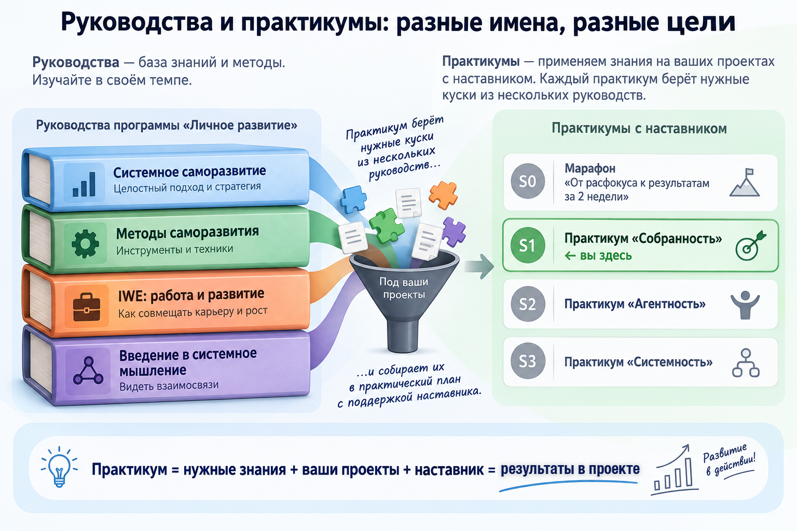
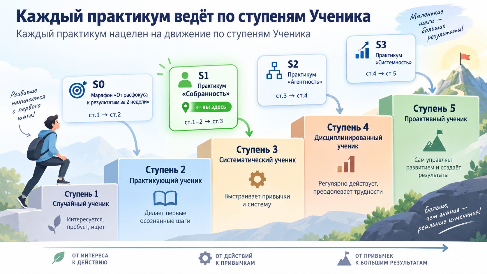
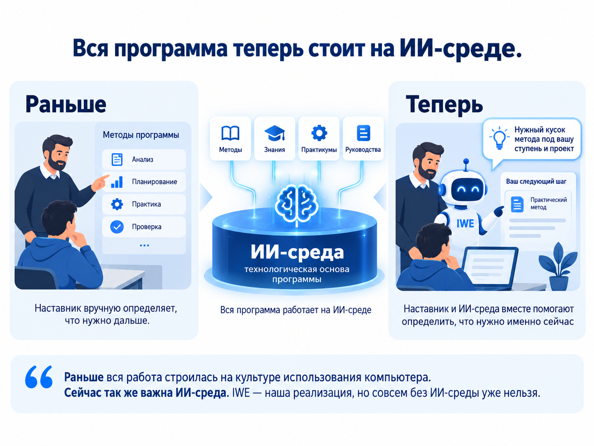
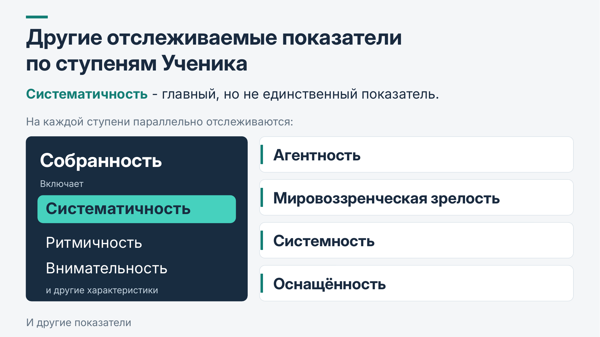
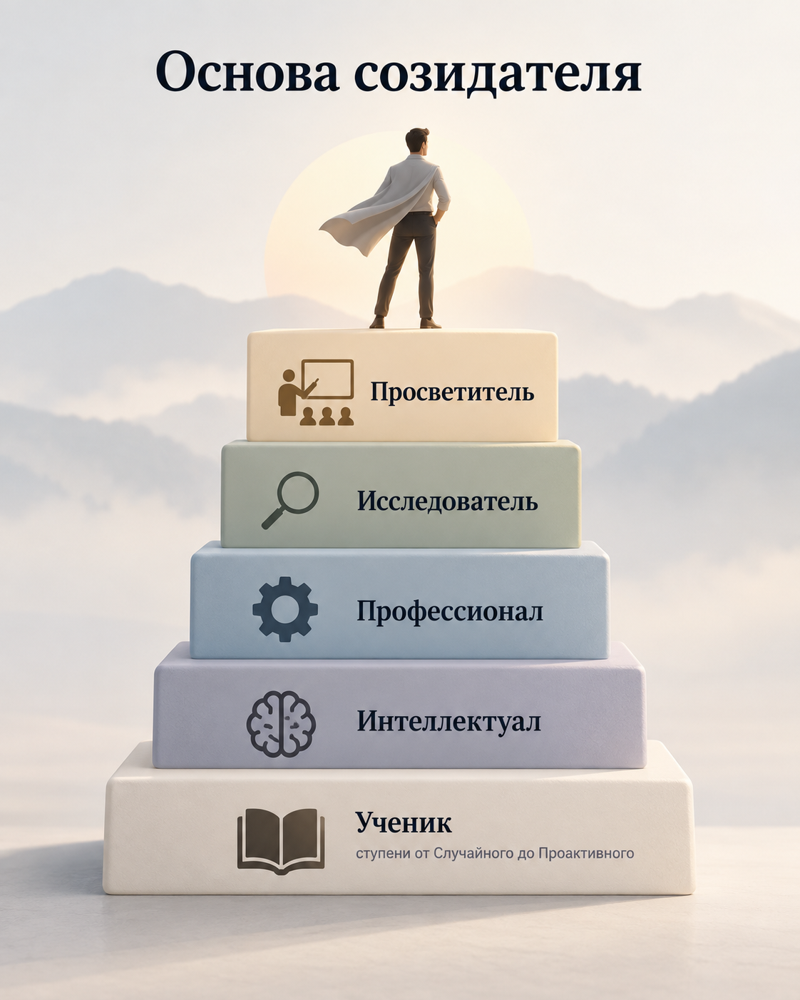

<!-- _class: title -->

# Практикум S1 «Собранность»

**Программа «Личное развитие» Мастерской инженеров-менеджеров**

Церен Церенов · 13 сентября 2026

---

## Сегодня

- Что изменилось в программе «Личное развитие»
- Практикум S1 «Собранность»
- Как выбрать свой проект
- Разбор ваших кейсов

---

## Свой проект вместо общего маршрута

> «Свой проект вместо общего учебного маршрута. Нужные методы и знания подключаются тогда, когда они требуются именно вашему следующему шагу.»

Сначала ставим способ работы на своём проекте подходящего масштаба — дальше переносите его на более сложные.

**Руководство и практикум — теперь разные вещи.**

---

---

---

<!-- _class: divider -->

# 10 минут

**Пишите в свою заметку, в чат — только рабочий продукт недели**

Вслух разберём 2-3 примера

---

---

---

**S1** — браузерная версия IWE + личный проект, **S2** — терминальная версия IWE (VS Code или аналоги) + рабочий проект

---

## Основной показатель — систематичность

---

---

<!-- _class: question -->

## Где на этой лестнице начинается S1

Практикум «Собранность» закрепляет ритм ступеней 1-2 и ведёт к ступени 3.

**В чат:** какая ступень сейчас кажется вам ближайшей?

*Не нужен точный ответ — это ориентир для вас самих.*

---

---

## Что растим на каждом практикуме

---

## Развитие Мастерства

---

## Персональное руководство пересобирается из вашей активности

Три источника: **ступень и узкое место** (диагностика) · **ваша реальная жизнь и работа** (действия, планы, результаты) · **ваш запрос**. Пересобирается по ходу движения — не выдаётся один раз.

---

## Как выбрать свой проект: три критерия

1. Решаемая проблема не является горящей
2. Рабочие продукты зависят прежде всего от ваших действий
3. Первый шаг обратим, без высокой цены ошибки

Название проекта наставник согласует с каждым лично. Расскажите о себе: чем занимаетесь, какие есть сложности и какие проекты рассматриваете. Напишите в чат потока S1 или в личку в Телеграм @tserentserenov.

---

## «Новичок» — не одна шкала, а пять разных

| Шкала | Что показывает |
|---|---|
| Культура сообщества | Насколько знакомы термины и ритуалы МИМ |
| Профессиональный опыт | Понимание корпоративной культуры и работа в командах |
| Собранность | Регулярность и самостоятельность практики |
| Системность | Насколько привычно системное мышление |
| ИТ-навыки | Уверенность в инструментах и технике |

Точка входа учитывает, где именно вам сейчас нужна поддержка.

---

## Примеры точек входа

Три личных примера — на них ставим сам способ работы.

| Проект | Первый шаг |
|---|---|
| **Похудение** | Начать вести дневник питания одну неделю |
| **«Мой день»** | Просто фиксировать, что происходит, без анализа |
| **Карьерный рост** | Разобраться, чего вы хотите от следующей роли |

**Дальше масштаб — рабочий проект.** Тот же способ работы дальше переносится на рабочую задачу, которая тормозит. Это не сегодняшнее упражнение — следующий шаг.

---

<!-- _class: question -->

## Живое упражнение: от того, что не устраивает, к делу на неделю

**Заранее:** пишут в чат все, вслух разберём 2-3 примера

1. Что сейчас не устраивает или хочется сдвинуть
2. Зачем это менять
3. Рабочий продукт недели — конкретная вещь, которую покажете через неделю
4. Как поймёте, что получилось

---

## Разбор через формулу «один сеанс — три результата»

Берём 2-3 прозвучавших рабочих продукта и разбираем вслух:

- откуда взялась неудовлетворённость
- какой отсюда рабочий продукт недели
- где здесь движение проекта, где рост мастерства, где усиление среды

---

## Как устроен практикум

Что делать на первой неделе:

0. Принять решение об участии до среды: оплатить, зарегистрировать аккаунт на сайте МИМ и прислать мейл аккаунта в личку телеграм @tserentserenov
1. Выбрать проект и согласовать его с наставником (смотрите в предыдущих слайдах)
2. Настроить браузерную версию IWE и собрать своё личное пространство (смотрите в следующем слайде)
3. Пройти сессию стратегирования в IWE
4. Определить рабочие продукты недели и стараться делать их каждый день (в IWE)
5. Рекомендация: открывать и закрывать день, включая рефлексию (в IWE)

---

## Настройка браузерной версии IWE

Выберите один из удобных для вас вариантов подключения:

- Claude.ai — https://t.me/systemsthinkinglife/704
- ChatGPT — https://t.me/systemsthinkinglife/724
- iwe.system-school.ru

Обсудите с ИИ несколько вопросов:

- зачем и почему именно вам нужна ИИ-среда
- что такое IWE и из чего состоит, чем отличается от чат-бота и ИИ-агентов
- как вам начать осваивать и разворачивать IWE

---

## Для тех, кто уже начинал

Если раньше заходили в практикум и остановились — **напишите нам, подберём, с чего продолжить**.

Не нужно ждать идеальной готовности — ракету перестраивают в полёте.

Напишите в личку сегодня-завтра, кто вы и на чём остановились.

---

<!-- _class: tip -->

# Как попасть

**Формат:** живая группа с наставником
**Запись до среды, число мест ограничено**
**Цена:** 35 тыс.руб., которая включает оплату Мастерской IWE

---

<!-- _class: question -->

# Вопросы

---

## Рефлексия и закрытие

**Один инсайт — в чат, одной фразой.**
