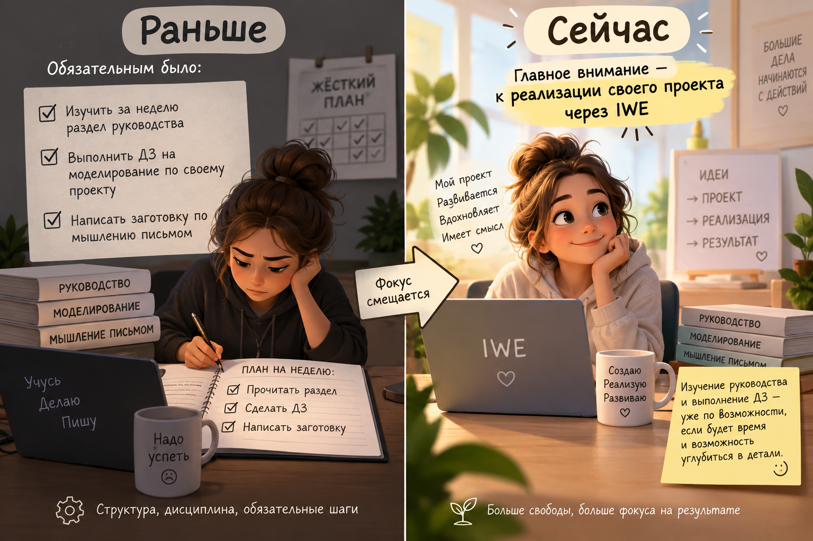
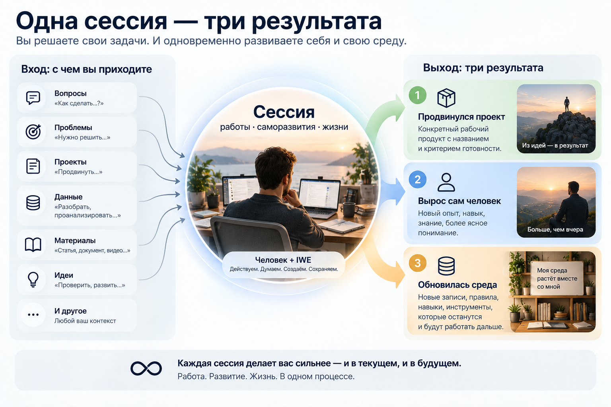
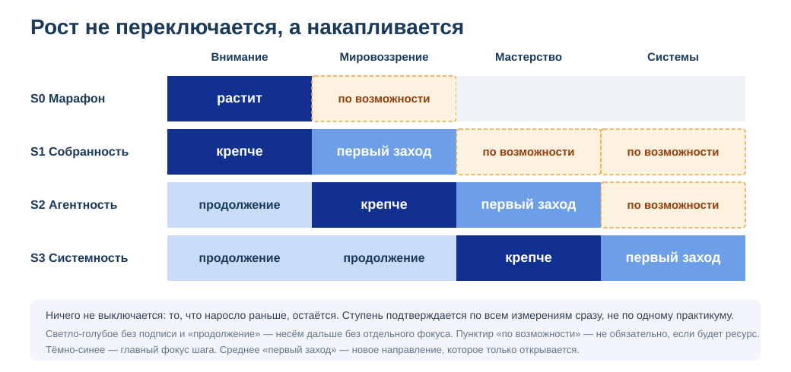
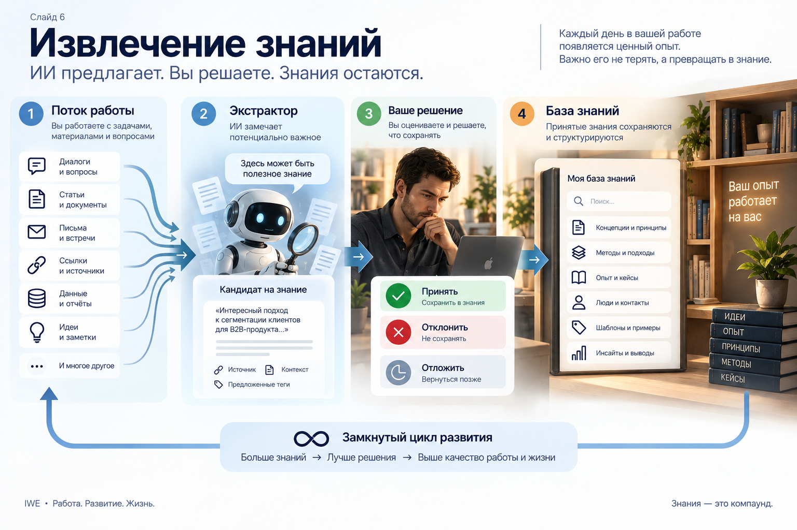

<!-- _class: title -->

# Практикум S2 «Агентность»

**Программа «Личное развитие» Мастерской инженеров-менеджеров**

Церен Церенов · 14 сентября 2026

---

## Сегодня

- Что нового в программе «Личное развитие»
- Практикум S2 «Агентность»
- Как продолжить или выбрать рабочий проект
- Разбор ваших кейсов

---

## Один реальный рабочий проект

Выберите **один проект из реальной работы** с наблюдаемым результатом.

Лучше важный, но не горящий: проект должен двигаться, пока вы осваиваете новый способ работы.

После S1 сохраняются метод, среда и история свидетельств. Предмет S2 — рабочий проект.

---

---

---

## Новый порядок работы

1. Берёте реальный рабочий проект
2. Выпускаете рабочие продукты
3. Замечаете конкретное затруднение
4. Получаете рекомендацию нужного метода или материала
5. Изучаете необходимый фрагмент и сразу применяете

> Руководство — справочник по живой проблеме, а не обязательный маршрут от первой страницы до последней.

---

## Матрица 4 мастерства: где стоит S2

|  | Управлять | Развивать |
|---|-----------|-----------|
| **Человек (ты сам)** | внимание, время, состояние, ритм | методы ученика, ступени |
| **Инструмент (IWE)** | оператор, не пассажир | достраивать под себя |

**S2 «Агентность» развивает верхнюю строку** — управление и развитие себя. Практикум по IWE — нижнюю.

> Инструмент сменный. Мастерство и мировоззрение остаются с вами навсегда.

---

## 8 практик саморазвития

| # | Практика | Управляет | Развивает |
|---|----------|-----------|-----------|
| 1 | Инвестирование и учёт времени | распределение времени | ритм |
| 2 | Медленное чтение | внимание при чтении | глубину мышления |
| 3 | Мышление письмом | фокус мысли | ясность |
| 4 | Мышление проговариванием | речевое внимание | объяснение |
| 5 | Организация досуга | восстановление | устойчивость |
| 6 | Формирование окружения | среду вокруг себя | поддержку роста |
| 7 | Стратегирование | направление | траекторию |
| 8 | Планирование | приоритеты | исполнительскую культуру |

---

## Основной показатель — систематичность

---

<!-- _class: question -->

## Где на этой лестнице начинается S2

Практикум «Агентность» закрепляет ритм ступеней 1-2, ведёт к ступени 3, закладывает фундамент ступени 4.

**В чат:** какая ступень сейчас кажется вам ближайшей?

---

---

## Другие отслеживаемые показатели

Систематичность — главный, но не единственный показатель.

- **Агентность** — в фокусе этого практикума
- Мировоззренческая зрелость
- Системность
- Оснащённость
- Собранность (Систематичность, Ритмичность, Внимательность)

> [нужна картинка] версия `learner-metrics.png` с выделенным блоком «Агентность» вместо «Собранность».

---

---

## Что растим на каждом практикуме

---

## Развитие Мастерства

---

## Персональное руководство пересобирается из вашей активности

Три источника: **ступень и узкое место** (диагностика) · **ваша реальная жизнь и работа** · **ваш запрос**.

---

**S1** — браузерная версия IWE + личный проект, **S2** — терминальная версия IWE (VS Code или аналоги) + рабочий проект

---

## Выберите один рабочий проект

Подойдёт проект из вашей реальной работы с наблюдаемым результатом.

На старте лучше **один проект**, даже если в работе их несколько.

Формулировка может быть черновой: сначала предъявите её, затем улучшайте через обратную связь.

**Стоп-кран:** проект обезличен · без секретов и конфиденциальных данных · не медицинское/юридическое/инвестиционное решение · не поручает ИИ внешние действия · результат под вашим контролем.

---

## Два таймбокса по 30 минут

**1. Самостоятельно:**

- название рабочего проекта
- наблюдаемый результат в физическом мире
- различение системы, её описания и рабочего продукта

**2. Вместе с IWE:**

- критика формулировки с помощью FPF
- особое внимание системам, состояниям и рабочим продуктам
- переработка текста до конца таймбокса

---

## Согласование проекта

1. Опубликуйте формулировку в общем чате
2. Конфиденциальный материал отправьте наставнику лично
3. Согласуйте название проекта и наблюдаемый итог
4. После согласования переходите к первому рабочему продукту

> Предъявляйте промежуточный результат вовремя — не ждите идеального текста.

---

## Как устроен практикум

Что делать на первой неделе:

1. Два таймбокса: черновик проекта → критика через IWE и FPF
2. Согласовать название и наблюдаемый результат с наставником
3. Выпустить первый рабочий продукт и разобрать метод по ВДВ
4. Начать учёт времени — цель 3-5 часов за 7 дней
5. Изучать материалы под конкретные затруднения проекта

**Новый стиль — одна специальная сессия в день. Остальную работу пока ведите привычным способом.**

---

## Начните с доступного интерфейса IWE

Для первых двух сессий подходит **браузерная версия IWE** — проверьте, что подключение MCP активно.

Терминальную версию в VS Code или аналоге можно разворачивать постепенно.

Браузер · Claude · ChatGPT · VS Code · телефон — интерфейсы могут меняться, но проекты и данные должны оставаться общей рабочей средой.

---

<!-- _class: question -->

# Вопросы

---

## Рефлексия и закрытие

**Один инсайт — в чат, одной фразой.**
