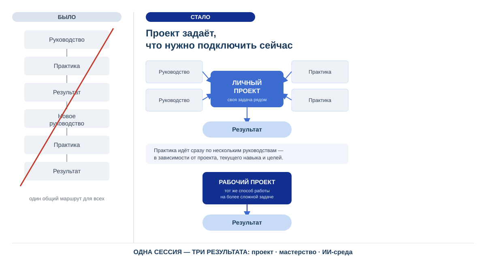

<!-- _class: title -->

# S2 «Агентность» · Встреча недели 1

**Разбор первой недели · метод недели 2**

Церен Церенов · 21 сентября 2026

---

## Сегодня

- Опрос: как прошла первая неделя
- Напоминание: главный результат недели
- Разбор трёх рабочих проектов вслух
- Перерыв
- Метод недели 2 на одном примере
- Перенос на свой проект
- Рабочее задание на неделю и итог встречи

---

## Опрос 1 — удержание внимания за неделю

**Насколько удалось удержать внимание на практикуме и своём проекте?**

1. Смог выделять слоты каждый день *(общее время не важно)*
2. Пропустил 1-2 дня
3. Смог выделить из всей недели только 1-2 дня
4. Совсем не получилось

---

## Опрос 2 — что ещё успели *(необязательно на первой неделе)*

Слоты — главное. Всё ниже — вторично:

- Провёл первую двойку слотов 25+25 (или меньше) и составил первую версию проекта
- Согласовано с наставником название проекта
- Подключён IWE (браузерная или терминальная версия)
- Проведена сессия стратегирования
- Составлен список РП на неделю

**Плюс в чат одной строкой:** рабочий проект, первый продукт (есть/нет), где застряли

---

## Напоминание: главный результат — слот каждый день

Содержание пока вторично. Типичное сообщение первой недели:

> «У меня не сбой. На этой неделе случилась срочная нагруженная командировка. Не смог выделить время, но обязуюсь догнать за выходные и неделю».

Объём можно догнать. **Пропущенные дни практики не восстановятся.**
**В чат:** когда следующий слот и что поможет его защитить?

---

<!-- _class: divider -->

# Разбор рабочих проектов

**Это система или описание системы?**

---

## Диагностическая карта первой недели

| Частая ошибка | Как проверить себя |
|---|---|
| Называю технологию вместо проекта | Что должно измениться, а не чем я это сделаю? |
| Перечисляю действия вместо результата | Что появится после работы? |
| Показываю документ вместо системы | Это система или описание системы? |
| Беру несколько проектов сразу | Прошёл хотя бы один полный цикл? |

---

## Живые кейсы (сквозные на весь практикум)

Миграция рабочих станций · стратегия для сложной системы · замена интеграций · «поиск работы» → «работа». Разные типы результата — не только ИТ.

---

<!-- _class: divider -->

# Перерыв

**Вторая половина начинается сразу с метода недели 2 — без повторного разогрева**

---

<!-- _class: divider -->

# Метод недели 2

**Бюджет слотов · лёгкое стратегирование · список РП**
**+ приёмы работы в слоте**

---

## Бюджет и учёт проектных слотов

- Сколько слотов в неделю реально можете выделить проекту
- Распределите их заранее между запланированными продуктами
- Ведите факт против плана — не «как пойдёт»

---

## Лёгкая сессия стратегирования: один проход здесь

Что хочу изменить в рабочем проекте на этой неделе → зачем → какой результат нужен → какие рабочие продукты для этого нужны.

> На встрече — один проход на одном примере. Полную сессию 15-20 минут делаете сами на неделе. Полная связка проблема → неудовлетворённость → цель → метод → проект — на неделе 8.

---

## Список рабочих продуктов на неделю

Не один продукт, как на неделе 1, а **2-4** с критерием готовности у каждого. Отмечайте готовые, дописывайте новые по ходу — не держите в голове.

---

## Слот 25+25 (напоминание): у половин разные роли

- **Первые 25 минут — сам:** думаю и пишу, создаю своё понимание
- **Вторые 25 минут — с ИИ:** говорю с ним или «думаю об него»
- Порядок не меняется; за слот — один инкремент

---

## Свой конвейер → запрос аналогии

Сначала 2-3 предложения своими словами: что на входе, какие стадии, что на выходе. Потом запрос:

> «Объясни, из каких систем состоит автоконвейер, а из чего состоит мой конвейер? Вот как я его вижу: …»

Берём **одно полезное соответствие**, **одно расхождение** и **предполагаемое узкое место** своего конвейера.

---

## Новые понятия и третий слот

- Понятие (ВДВ, рабочий продукт, система и состояние, FPF…) — одной строкой в **отдельный список**: папка «Понятия» в «Моём стратегировании», один файл
- Строка: понятие · где встретил · моё понимание · разобрано/нет
- **Третий слот** — кроме 25+25, из крошек времени: своё объяснение → проверка у ИИ → пример из проекта

---

<!-- _class: question -->

# Перенос на свой проект · 13 минут молча

1. Один рабочий продукт недели 2 + критерий готовности (остальные — до списка из 2-4 — на неделе)
2. Свой запрос аналогии одной строкой
3. Одно новое понятие — в список

**В чат — продукт и критерий.**

---

## Рабочее задание на неделю: на что обращать внимание

1. Держите ежедневный слот: первые 25 минут пишите сами, вторые 25 обсуждайте с ИИ
2. Проведите короткую сессию стратегирования: что изменить в одном рабочем проекте и зачем
3. Выберите 2-4 рабочих продукта недели с критериями готовности и распределите между ними доступные слоты; ведите план и факт
4. Опишите свой конвейер своими словами, затем запросите аналогию с автоконвейером и проверьте предполагаемое узкое место
5. Заведите папку «Понятия» в «Моём стратегировании» со списком; разбирайте его в третьем слоте, когда есть время
6. На встречу принесите список продуктов с отметками готовности, план и факт слотов, один вопрос

---

<!-- _class: question -->

# Вопросы

---

<!-- _class: tip -->

# Итог встречи

- Один рабочий проект и наблюдаемое изменение в нём
- Проверяем, нужен ли на этом шаге документ или изменение самой системы
- Продукты недели выбираем под доступное время и сравниваем план с фактом
- Сначала думаем сами, затем проверяем с ИИ; аналогии уточняем, понятия сохраняем
- Работаем итерациями, сохраняя ежедневный ритм
