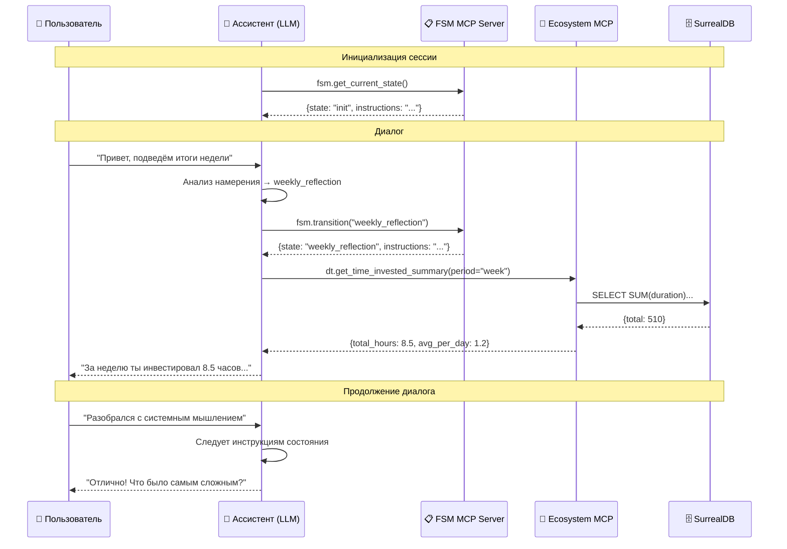

# FSM-архитектура ИИ-ассистентов с доступом через MCP

> **ADR (Architecture Decision Record):** Архитектурное решение для организации логики ИИ-ассистентов на основе конечного автомата (FSM) с доступом к базам данных экосистемы через MCP-протокол.

---

## 0. Резюме решения

**Проблема:** Как организовать сложную логику ИИ-ассистентов (диалоговые сценарии, доступ к данным, переходы между состояниями) так, чтобы разработчики могли легко создавать и поддерживать ассистентов без глубоких знаний программирования?

**Решение:** Использовать паттерн **Finite State Machine (FSM)** для описания логики ассистента в виде markdown-файлов состояний, с доступом к данным (цифровой двойник, руководства) через **MCP-инструменты**.

**Референсная реализация:** [github.com/aisystant/fsm-mcp](https://github.com/aisystant/fsm-mcp)

---

## 1. Решаемая проблема

### 1.1 Контекст

В экосистеме развивается семейство ИИ-ассистентов:
- **Ассистент Ученика** (Проводник по персональному маршруту)
- Ассистенты для конкретных курсов и модулей
- Ассистенты для рефлексии, планирования, целеполагания

Каждый ассистент:
- Ведёт структурированный диалог с пользователем
- Запрашивает данные из **Цифрового двойника** (прогресс, активности, состояния)
- Использует **Руководства** (контент курсов, методологии)
- Должен следовать определённой логике и переходам между "темами" разговора

### 1.2 Проблемы текущего подхода

| Проблема | Последствие |
|----------|-------------|
| Логика ассистента "зашита" в промпт | Сложно поддерживать и расширять |
| Нет явной структуры диалога | Ассистент "теряется" в длинных разговорах |
| Доступ к данным не формализован | Разные ассистенты дублируют логику запросов |
| Разработчик = программист | Методологи и эксперты не могут создавать ассистентов |

### 1.3 Сценарий для конечного пользователя

**Сценарий: Еженедельная рефлексия с Ассистентом Ученика**

```
👤 Пользователь: "Привет, давай подведём итоги недели"

🤖 Ассистент (состояние: init):
   → Распознаёт намерение "рефлексия"
   → Переходит в состояние: weekly_reflection

🤖 Ассистент (состояние: weekly_reflection):
   → Читает инструкции состояния
   → Вызывает MCP-инструмент: dt.get_time_invested_summary(period="week")
   → Получает: {total_hours: 8.5, average_per_day: 1.2}

🤖 Ассистент:
   "На этой неделе ты инвестировал 8.5 часов — примерно 1 час 12 минут в день.
    Это больше, чем на прошлой неделе!

    Расскажи, что получилось особенно хорошо?"

👤 Пользователь: "Наконец-то разобрался с системным мышлением..."

🤖 Ассистент (состояние: weekly_reflection):
   → Следует инструкциям состояния
   → Задаёт уточняющие вопросы
   → Формирует итоговую заметку
   → Вызывает: dt.save_reflection_note(...)
   → Переходит в состояние: next_week_planning
```

**Что видит пользователь:** Связный диалог с осмысленными вопросами и персонализированными данными.

**Что происходит "под капотом":** Ассистент переходит между состояниями FSM, выполняет инструкции каждого состояния, вызывает MCP-инструменты для доступа к данным.

---

## 2. Архитектурное решение

### 2.1 Ключевые компоненты

```
┌─────────────────────────────────────────────────────────────────┐
│                     FSM-MCP Репозиторий                         │
│  ┌──────────────┐  ┌─────────────────────────────────────────┐  │
│  │ instructions/│  │              states/                    │  │
│  │              │  │  ┌───────┐ ┌─────────────┐ ┌─────────┐ │  │
│  │ • Роль       │  │  │init.md│→│weekly_      │→│planning │ │  │
│  │ • Принципы   │  │  │       │ │reflection.md│ │.md      │ │  │
│  │ • Формат     │  │  └───────┘ └─────────────┘ └─────────┘ │  │
│  │ • Ограничения│  │      ↑           ↓            ↓        │  │
│  └──────────────┘  │  ┌───────────────────────────────┐     │  │
│                    │  │        Другие состояния        │     │  │
│                    │  └───────────────────────────────┘     │  │
│                    └─────────────────────────────────────────┘  │
└─────────────────────────────────────────────────────────────────┘
                              ↓ MCP
┌─────────────────────────────────────────────────────────────────┐
│                     MCP-серверы экосистемы                      │
│  ┌─────────────────────┐       ┌─────────────────────────────┐  │
│  │   ecosystem-mcp     │       │       fsm-mcp-server        │  │
│  │                     │       │                             │  │
│  │ dt.* → Цифровой     │       │ fsm.get_state() →           │  │
│  │        двойник      │       │   читает states/*.md        │  │
│  │                     │       │                             │  │
│  │ edu.* → Руководства │       │ fsm.transition(next_state)  │  │
│  │         и контент   │       │   → меняет текущее состояние│  │
│  └─────────────────────┘       └─────────────────────────────┘  │
└─────────────────────────────────────────────────────────────────┘
                              ↓
┌─────────────────────────────────────────────────────────────────┐
│                      Базы данных                                │
│  ┌─────────────────────┐       ┌─────────────────────────────┐  │
│  │  SurrealDB          │       │  Репозиторий aisystant/docs │  │
│  │  (Цифровой двойник) │       │  (Руководства, курсы)       │  │
│  └─────────────────────┘       └─────────────────────────────┘  │
└─────────────────────────────────────────────────────────────────┘
```

### 2.2 Структура FSM-репозитория

```
/fsm-mcp/
├── README.md                    # Документация для разработчиков
├── instructions/                # Базовые инструкции (всегда активны)
│   ├── role.md                  # Роль и личность ассистента
│   ├── principles.md            # Принципы поведения
│   ├── format.md                # Формат ответов
│   └── restrictions.md          # Ограничения и безопасность
│
├── states/                      # Состояния диалога
│   ├── init.md                  # Начальное состояние
│   ├── weekly_reflection.md     # Еженедельная рефлексия
│   ├── goal_setting.md          # Постановка целей
│   ├── progress_review.md       # Обзор прогресса
│   ├── learning_session.md      # Учебная сессия
│   └── ...
│
├── tools/                       # Описание доступных инструментов
│   ├── dt_tools.md              # Инструменты Цифрового двойника
│   └── edu_tools.md             # Инструменты для работы с контентом
│
└── schemas/                     # Схемы данных
    ├── reflection.json          # Формат заметки рефлексии
    └── goal.json                # Формат цели
```

### 2.3 Формат файла состояния

Каждый файл состояния (например, `states/weekly_reflection.md`) содержит:

```markdown
# Состояние: weekly_reflection

## Цель состояния
Провести структурированную рефлексию за неделю, зафиксировать достижения
и точки роста, сформировать заметку для Цифрового двойника.

## Триггеры входа
- Пользователь просит "подвести итоги недели"
- Пользователь говорит "рефлексия", "что я сделал за неделю"
- Переход из состояния `init` при соответствующем намерении
- Автоматический переход в воскресенье вечером (если настроено)

## Инструкции

### Шаг 1: Получение данных
Перед началом диалога запроси данные через MCP:

**Обязательные вызовы:**
- `dt.get_time_invested_summary(period="week")` — инвестированное время
- `dt.get_activities(period="week", limit=10)` — последние активности
- `dt.get_states(period="week")` — эмоциональные состояния

**Если пользователь разрешил:**
- `dt.get_goals(status="active")` — текущие цели

### Шаг 2: Открывающий вопрос
Начни с признания вложенного времени и открытого вопроса:
- Используй данные о времени для персонализации
- Спроси, что получилось особенно хорошо

### Шаг 3: Углубление
Задай 2-3 уточняющих вопроса:
- Что было сложным?
- Что удивило?
- Что хочется продолжить на следующей неделе?

### Шаг 4: Формирование заметки
Сформируй структурированную заметку рефлексии:
```json
{
  "type": "weekly_reflection",
  "period": {"start": "...", "end": "..."},
  "achievements": ["..."],
  "challenges": ["..."],
  "insights": ["..."],
  "next_week_focus": ["..."]
}
```

### Шаг 5: Сохранение и переход
- Вызови `dt.save_reflection_note(note)` для сохранения
- Предложи перейти к планированию следующей недели

## Разрешённые инструменты
- `dt.get_time_invested_summary`
- `dt.get_activities`
- `dt.get_states`
- `dt.get_goals`
- `dt.save_reflection_note`

## Переходы
| Условие | Следующее состояние |
|---------|---------------------|
| Пользователь хочет планировать | `next_week_planning` |
| Пользователь хочет глубже разобрать тему | `deep_dive` |
| Пользователь завершает разговор | `init` |
| Пользователь спрашивает не по теме | `init` (с обработкой вопроса) |

## Ограничения
- Не давай оценок "хорошо/плохо" времени — только факты
- Не сравнивай с другими пользователями
- Если данных нет — задай 2-3 вопроса и продолжи без данных
```

### 2.4 Взаимодействие компонентов



### 2.5 MCP-инструменты для FSM

FSM MCP Server предоставляет следующие инструменты:

| Инструмент | Назначение |
|------------|------------|
| `fsm.get_current_state()` | Получить текущее состояние и его инструкции |
| `fsm.get_state(state_id)` | Получить инструкции конкретного состояния |
| `fsm.transition(next_state)` | Перейти в новое состояние |
| `fsm.get_available_transitions()` | Список доступных переходов из текущего состояния |
| `fsm.get_instructions()` | Получить базовые инструкции ассистента |

### 2.6 Разделение ответственности

| Компонент | Знает | Не знает |
|-----------|-------|----------|
| **Инструкции (instructions/)** | Роль, принципы, формат, ограничения — что верно всегда | Конкретные сценарии |
| **Состояния (states/)** | Цель сценария, шаги, вопросы, переходы | Как получить данные из БД |
| **MCP-инструменты (ecosystem-mcp)** | Как получить/записать данные | Зачем пользователю нужны эти данные |
| **LLM (ассистент)** | Когда и какой инструмент вызвать | SQL-запросы и структура БД |

---

## 3. Процесс работы разработчика

### 3.1 Роли разработчиков

| Роль | Зона ответственности | Необходимые навыки |
|------|----------------------|---------------------|
| **Методолог/Эксперт** | Состояния, сценарии, вопросы | Markdown, понимание UX диалогов |
| **Архитектор ассистента** | Структура FSM, переходы, инструкции | Системное мышление, Markdown |
| **Разработчик MCP** | Инструменты, интеграция с БД | Python/TypeScript, SQL, MCP SDK |
| **Владелец данных** | Схемы данных, Resources | JSON Schema, понимание домена |

### 3.2 Workflow создания нового ассистента

```
┌─────────────────────────────────────────────────────────────────┐
│ 1. ПРОЕКТИРОВАНИЕ (Методолог + Архитектор)                      │
├─────────────────────────────────────────────────────────────────┤
│ • Определить целевую аудиторию и задачи ассистента              │
│ • Нарисовать карту состояний (FSM-диаграмму)                    │
│ • Определить, какие данные нужны на каждом шаге                 │
│ • Согласовать с владельцем данных доступные инструменты         │
└─────────────────────────────────────────────────────────────────┘
                              ↓
┌─────────────────────────────────────────────────────────────────┐
│ 2. БАЗОВЫЕ ИНСТРУКЦИИ (Архитектор)                              │
├─────────────────────────────────────────────────────────────────┤
│ Создать файлы в instructions/:                                   │
│ • role.md — "Ты — Проводник по персональному маршруту..."       │
│ • principles.md — принципы поведения                             │
│ • format.md — как форматировать ответы                          │
│ • restrictions.md — что запрещено                                │
└─────────────────────────────────────────────────────────────────┘
                              ↓
┌─────────────────────────────────────────────────────────────────┐
│ 3. СОСТОЯНИЯ (Методолог)                                         │
├─────────────────────────────────────────────────────────────────┤
│ Для каждого состояния создать файл в states/:                    │
│ • Цель состояния                                                 │
│ • Триггеры входа                                                 │
│ • Пошаговые инструкции                                          │
│ • Какие данные запросить (список MCP-инструментов)               │
│ • Какие вопросы задать                                          │
│ • Какой результат сформировать                                   │
│ • Переходы в другие состояния                                    │
└─────────────────────────────────────────────────────────────────┘
                              ↓
┌─────────────────────────────────────────────────────────────────┐
│ 4. ИНСТРУМЕНТЫ (Разработчик MCP)                                │
├─────────────────────────────────────────────────────────────────┤
│ Если нужных инструментов нет в ecosystem-mcp:                    │
│ • Согласовать контракт (Input/Output Schema)                     │
│ • Реализовать handler в ecosystem-mcp                           │
│ • Добавить в mcp-manifest.json                                   │
│ • Задокументировать в tools/*.md репозитория FSM                 │
└─────────────────────────────────────────────────────────────────┘
                              ↓
┌─────────────────────────────────────────────────────────────────┐
│ 5. ТЕСТИРОВАНИЕ (Архитектор + Методолог)                        │
├─────────────────────────────────────────────────────────────────┤
│ • Проверить каждое состояние вручную                            │
│ • Проверить переходы между состояниями                          │
│ • Проверить обработку edge cases                                 │
│ • Проверить режим "без данных" (если MCP недоступен)            │
└─────────────────────────────────────────────────────────────────┘
                              ↓
┌─────────────────────────────────────────────────────────────────┐
│ 6. ДЕПЛОЙ                                                        │
├─────────────────────────────────────────────────────────────────┤
│ • Опубликовать репозиторий FSM                                   │
│ • Подключить FSM MCP Server к платформе                         │
│ • Настроить GPT/Claude с подключением к MCP                     │
└─────────────────────────────────────────────────────────────────┘
```

### 3.3 Чек-лист для файла состояния

При создании нового состояния разработчик должен ответить на вопросы:

- [ ] **Цель:** Что должно быть на выходе из этого состояния?
- [ ] **Триггеры:** Когда ассистент переходит в это состояние?
- [ ] **Данные:** Какие MCP-инструменты нужно вызвать?
- [ ] **Согласие:** Нужно ли спрашивать разрешение на доступ к данным?
- [ ] **Вопросы:** Какие вопросы задать пользователю?
- [ ] **Результат:** Что сохранить / сформировать?
- [ ] **Переходы:** Куда можно перейти дальше?
- [ ] **Fallback:** Что делать, если данных нет или пользователь не отвечает?

### 3.4 Пример: добавление нового состояния

**Задача:** Добавить состояние "Постановка цели на неделю"

**Шаг 1:** Создать файл `states/weekly_goal_setting.md`

```markdown
# Состояние: weekly_goal_setting

## Цель состояния
Помочь пользователю сформулировать одну конкретную, измеримую цель на неделю
и записать её в Цифровой двойник.

## Триггеры входа
- Переход из `weekly_reflection` после завершения рефлексии
- Пользователь явно просит "поставить цель на неделю"
- Начало недели (понедельник) — предложение ассистента

## Инструкции

### Шаг 1: Контекст
Если есть данные — запроси:
- `dt.get_goals(status="completed", period="last_month")` — достигнутые цели
- `dt.get_current_level()` — текущий уровень

### Шаг 2: Фокусировка
Задай вопрос:
"На чём ты хочешь сфокусироваться на этой неделе?
Это может быть навык, тема для изучения или конкретный результат."

### Шаг 3: Уточнение
Помоги сделать цель конкретной:
- Как ты поймёшь, что цель достигнута?
- Сколько времени планируешь инвестировать?
- Какой первый шаг?

### Шаг 4: Формализация
Сформируй цель в формате:
```json
{
  "type": "weekly_goal",
  "title": "...",
  "success_criteria": "...",
  "time_budget_hours": N,
  "first_step": "...",
  "deadline": "YYYY-MM-DD"
}
```

### Шаг 5: Сохранение
- Вызови `dt.save_goal(goal)`
- Подтверди сохранение пользователю

## Разрешённые инструменты
- `dt.get_goals`
- `dt.get_current_level`
- `dt.save_goal`

## Переходы
| Условие | Следующее состояние |
|---------|---------------------|
| Цель сохранена | `init` с подтверждением |
| Пользователь отказывается | `init` |
| Пользователь хочет обсудить подробнее | `goal_deep_dive` |
```

**Шаг 2:** Обновить `states/init.md` — добавить переход в новое состояние

**Шаг 3:** Проверить, что инструмент `dt.save_goal` существует в ecosystem-mcp

**Шаг 4:** Протестировать диалог

---

## 4. Принципы проектирования

### 4.1 Принципы для состояний

1. **Одно состояние — одна цель**
   - Состояние решает одну задачу
   - Если задача сложная — разбить на несколько состояний

2. **Явные переходы**
   - Каждый переход должен быть описан
   - Нет "магических" переходов по умолчанию

3. **Graceful degradation**
   - Если данных нет — продолжить без них
   - Задать 2-3 вопроса вместо запроса к БД

4. **Минимизация данных**
   - Запрашивать только то, что нужно для текущего состояния
   - Явно указывать, какие данные опциональны

### 4.2 Принципы для инструментов

1. **Один инструмент — один осмысленный запрос**
   - Инструмент отвечает на конкретный вопрос человека
   - Не "get_all_data", а "get_time_invested_summary"

2. **Явное согласие**
   - Инструменты, читающие персональные данные, требуют согласия
   - Согласие запрашивается один раз в начале сессии

3. **Контракты через Resources**
   - Семантика данных описана в Resources (`dt://catalogs/metrics`)
   - И ассистент, и MCP-сервер используют одну онтологию

### 4.3 Безопасность и приватность

| Аспект | Решение |
|--------|---------|
| Доступ к данным | Явное согласие пользователя в начале сессии |
| Минимизация | Запрашивать только нужные поля |
| Аудит | Логировать все MCP-вызовы |
| Ограничения | Список разрешённых инструментов в каждом состоянии |

---

## 5. Связанные документы

- [[Организация MCP-хранилища]] — структура ecosystem-mcp
- [[Реализация MCP (Model Context Protocol) для сценария запроса инвестированного времени]] — пример реализации
- [[Канонический шаблон описания MCP Tools и Resources]] — формат описания инструментов
- [[4.5. Проводник по персональному маршруту]] — целевой ассистент
- [[3.4. Описание единого хранилища знаний (Memory Bank)]] — источники данных

---

## 6. Открытые вопросы

1. **Версионирование состояний:** Как управлять версиями FSM при обновлении логики для активных пользователей?

2. **Персистентность:** Где хранить текущее состояние пользователя между сессиями?

3. **Мультиязычность:** Как организовать состояния для разных языков?

4. **Тестирование:** Как автоматизировать тестирование FSM-сценариев?

---

## 7. Следующие шаги

1. **Создать референсный репозиторий** `aisystant/fsm-mcp` с базовой структурой
2. **Реализовать FSM MCP Server** — сервер, читающий состояния из репозитория
3. **Мигрировать Ассистента Ученика** на FSM-архитектуру
4. **Документировать** процесс для методологов

---

**Статус:** Черновик
**Ответственный:** Команда экосистемы
**Дата принятия:** Ожидает ревью
